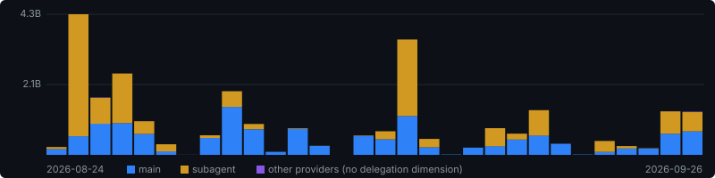

# Christian McCaffrey

**CEO, [VeUP](https://veup.com)** · Florida · AWS Partner

*Client delivery runs on an agent swarm. The tooling is public and the numbers are audited.*

`Multi-Agent Delivery` · `Agentic Coding` · `Tropical Attention` · `AWS` · `Rust` · `Swift` · `Local-First AI`

<a href="#the-operating-model">Operating Model</a> · <a href="#open-source">Open Source</a> · <a href="#research">Research</a> · <a href="#not-public">Not Public</a> · <a href="#how-the-numbers-are-made">Instrumentation</a> · <a href="#principles">Principles</a>

---

Blue is work I direct. Amber is work the swarm directs on its own — about half of it.

<!-- BEGIN LIVE-SUMMARY -->
> [!NOTE]
> **125.9B tokens** over 150 active days · 28 models · 9 labs · 92% cache reads · 55% spent by subagents.
> Reconciled by [flightdeck](https://github.com/cmc-veup/flightdeck) from transcripts on disk, plus archives of the
> months Claude Code deleted. April is still gone, so this is a floor. Regenerated hourly.
<!-- END LIVE-SUMMARY -->

---

## The Operating Model

I run an AWS partner business where delivery is increasingly executed by agent swarms rather than by hand. That is a claim people make loosely, so here is what it concretely means day to day.

<!-- BEGIN LIVE-TABLE -->
| | |
|---|---|
| **Scale** | 0 → 906 agents/day, elastic · typical wave 347–732 · 532 in flight at peak hour |
| **Fan-out** | 55% of recent tokens spent by subagents; 41% across the months whose transcripts survived. |
| **Provider diversity** | 28 models, 9 labs — though one carries 85% of spend. |
| **Cost discipline** | 92% of tokens are cache reads, at a tenth of input price. |
| **Accounting** | 99% priced from a published card, 0.7% estimated, 0.0% unpriced — at the rate in force *when spent*. |
<!-- END LIVE-TABLE -->

The interesting problems at this scale are not prompting problems. They are coordination, attribution, recovery, and measurement problems — which is why most of what I build is infrastructure rather than applications.

---

## Open Source

| Project | Lang | What it does |
|:--------|:----:|:-------------|
| [**flightdeck**](https://github.com/cmc-veup/flightdeck) |  | Truthful multi-provider token accounting for local AI coding agents. Reads the transcripts Claude Code, Codex, Grok and anything behind a Claude Code shell already write to disk. Recovers months the tooling deleted, treats subagent spend as a first-class dimension, and prices every token at the rate in force when it was spent. |
| [**zfc**](https://github.com/cmc-veup/zfc-skill) |  | Zero Framework Cognition (Yegge) as an agent skill. Keep judgment in the model and heuristics out of the application. Violation catalog, audit playbook, model routing, identity discipline. Every regex you write against model output is a bet against the next model. |
| [**ai-sdlc-gate**](https://github.com/cmc-veup/ai-sdlc-gate) |  | A two-layer PR gate for repos where most code is written by agents. Deterministic checks block first; a model reviews second, and only findings that survive N-way adversarial verification are reported. Regex gathers secret candidates, a model judges them — because five patterns deciding what a secret is, is a pattern making a judgement call. |
| [**claude-cli-oauth-brain-transport**](https://github.com/cmc-veup/claude-cli-oauth-brain-transport-skill) |  | Using the Claude CLI as a first-class inference path for swarm orchestration. What the print-mode envelope actually guarantees, why `--json-schema` does not constrain it, and how to get reliably parseable output anyway. |

---

## Research

**Tropical attention at the edge.** Replacing softmax with the max-plus (tropical) semiring, where `a ⊕ b = max(a,b)` and `a ⊗ b = a + b`. Every multiplication collapses into add-and-compare, which changes what the hardware has to be:

- **Structurally predictable latency.** Re-bracketing attention as `(V ⊗ Kᵀ) ⊗ Q` never materializes the L×L matrix, so it maps onto an add/compare systolic array. Sub-millisecond determinism becomes a property of the algebra rather than something you measure and hope for.
- **Order-invariant.** The reduction is a max, not a sum, so a result does not depend on the order operands are combined in — bitwise reproducible across hardware rather than approximately so.
- **Interpretability that is not a heatmap.** The argmax at each node *is* a discrete route, so attributions are exact rather than inferred, and each carries a margin: min-gap/2 on the scores. Input-space radii divide by the block's Lipschitz constant, since Q, K and V each carry a copy of the input.

Built on Jeffrey Emanuel's [model_guided_research](https://github.com/Dicklesworthstone/model_guided_research), which explores eleven exotic mathematical structures as transformer primitives — most as swappable attention blocks, plus an ordinal learning-rate schedule and a hyperreal optimizer. Carried into on-device safety inference and a scoring engine.

---

## Not Public

Most of the work is not open source — it either encodes something client-specific or is not finished enough to hand someone. The shape of it:

| | |
|---|---|
| **Swarm orchestration** | Running agents by the hundred against a shared work queue: leases, federation, recovery, and the accounting that proves what they actually cost. |
| **Meeting intelligence** | Local-first Mac capture. Transcription and diarization on-device; audio never leaves the machine, only text reaches a model. |
| **A unified tool server** | One MCP surface over the dozen-odd business systems delivery actually runs on, so an agent gets a single contract instead of a dozen auth dances. |
| **Autonomous operating reports** | Agents that assemble the monthly estate review, where every claim has to link to a receipt or it does not ship. |
| **Delivery practice** | Forward-deployed engineering, AI-DLC, and living roadmaps that stay current because agents maintain them rather than people remembering to. |

What generalizes gets extracted and published here. What encodes a client stays in.

---

## How the Numbers Are Made

The badges above are not hand-typed, and the story of why they exist is the reason I trust them.

Every usage dashboard on my machine was wrong in a different way. One was reading a cache that had not updated in four months. Another counted characters instead of tokens. All of them either double-counted subagent transcripts or could not see them at all. So the reported estate was ~35B tokens.

The audit put it at roughly **78B**, and the figure above is higher because it keeps
moving. Three things had gone wrong:

1. **Claude Code deletes transcripts after 30 days** by default (`cleanupPeriodDays`). April and May were simply gone from disk. The tell was that a cumulative counter had *fallen* — 56.62B in May, 46.90B in June. A total that decreases is proof of deletion, not of lower usage.
2. **"Per-event data always wins" discarded 11.78B** of real subagent burn, because archive sources sometimes hold sessions the per-event stream never captured. The correct rule is max-per-session: both sources are floors.
3. **22% of tokens were priced at $0** because they matched no pricing pattern, and one model was seeded 4× low.

flightdeck exists so those failures are detectable rather than silent. It reconciles across sources, prices with effective dating, and reports what share of tokens is priced from a published card versus estimated versus unpriced — so a silent $0 cannot masquerade as thrift. It still cannot see April 2026, which is why every total here is a floor.

---

## Principles

**Structure in code, judgment in the model.** The application is dumb pipes; the model is the smart endpoint. Schema validation, budget caps, and retry policy belong in code. Ranking, classification, and "is this done" belong to the model. Every heuristic is a bet against the next model release, and that bet has lost every quarter so far.

**Delivered work is the smaller of what you can produce and what you can verify.** Agents made production cheap and left verification exactly where it was. Buying more generation against an unchanged ability to check it buys nothing — the constraint moved to verification the moment generation got cheap, and most of this industry is still buying the other side of it.

**A swarm scales by removing shared state, not by adding agents.** Every lock, gate, and central dispatcher turns parallel work back into serial work. What capped concurrency here was never compute — it was the number of things two agents could want at the same time.

**A number you cannot audit is a number you cannot manage.** Most of this industry is reporting AI usage figures nobody has checked. Mine are checkable, which is the entire reason the collector is public.

**Receipts or it did not happen.** Internal reporting rule: every claim links to a diff, a test, or a demo. Prose that cannot cite itself gets cut.

---

## Connect

I run [VeUP](https://veup.com), an AWS partner. The work I care about is at the frontier: delivery executed by agent swarms, measured honestly enough to trust.

